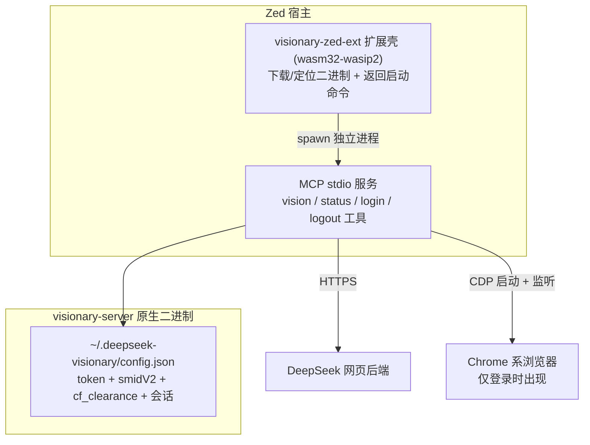

# DeepSeek Visionary

在 Zed 中使用 **DeepSeek 网页版的原生多模态视觉模型** 的 MCP 扩展，支持**浏览器自动登录**（无需手动复制 token）。

这是 Python 版 `deepseek-vision-mcp` 的 Rust 全量重写：单原生二进制 + Zed 扩展壳，多平台分发。

## 架构



- **visionary-server**：MCP stdio 服务，实现完整 vision 流水线（PoW → 上传 → fork → HIF 签名 → SSE 流式 completion）与 CDP 自动登录
- **visionary-zed-ext**：Zed 扩展壳，按平台从 GitHub Releases 下载/缓存 visionary-server 并启动

## 安装

1. 从 Zed 扩展市场安装 `DeepSeek Visionary`（或在开发模式下安装本地扩展）
2. 在 Zed 中调用 MCP 工具 `deepseek_vision_login` 完成自动登录：
   - 会打开浏览器窗口并导航到 chat.deepseek.com
   - 在浏览器中登录后，工具自动抓取 token 并保存
3. 直接使用 `deepseek_vision` 识图

> 手动兜底：登录 chat.deepseek.com 后，DevTools → Application → Local Storage →
> `userToken` → 复制 `JSON.parse(value).value`，写入 `~/.deepseek-visionary/config.json`：
>
> ```json
> { "user_token": "你的 token" }
> ```

## 工具

| 工具 | 说明 |
|------|------|
| `deepseek_vision` | 上传本地图片（路径 / base64）并用 DeepSeek 视觉模型分析。参数：`image`（必填）、`prompt`、`thinking`、`continue_conversation`、`session_id` |
| `deepseek_vision_status` | 检查登录状态与 token 有效性（含真实校验探针） |
| `deepseek_vision_login` | 浏览器自动登录并抓取凭据 |
| `deepseek_vision_logout` | 清除保存的凭据 |

### 会话续聊

`deepseek_vision` 支持多轮对话：

- `continue_conversation=true`：复用上一次会话，可对比多张图片
- `session_id`：显式切换到指定会话线程

会话状态持久化在 `~/.deepseek-visionary/session.json`。

## Zed 权限建议

在 Zed 设置中为扩展授予工具权限：

```json
{
  "agent": {
    "tool_permissions": {
      "context_servers.deepseek-visionary": {
        "deepseek_vision": "allow",
        "deepseek_vision_login": "allow",
        "deepseek_vision_status": "allow",
        "deepseek_vision_logout": "allow"
      }
    }
  }
}
```

## 开发

```bash
# 构建原生服务
cargo build -p visionary-server --release

# 构建扩展壳（wasm32-wasip2）
rustup target add wasm32-wasip2
cargo build -p visionary-zed-ext --release --target wasm32-wasip2

# 测试
cargo test -p visionary-server
```

本地联调：在 Zed 中通过 `Extensions → Install Dev Extension` 选择 `crates/visionary-zed-ext` 目录；
调试时可在扩展设置中配置 `server_path` 指向本地构建的 visionary-server。

## 环境变量

| 变量 | 说明 |
|------|------|
| `DEEPSEEK_USER_TOKEN` | 覆盖 config.json 中的 token（可选） |
| `DEEPSEEK_SMIDV2` / `DEEPSEEK_CF_CLEARANCE` | 覆盖对应 cookie（可选） |
| `DEEPSEEK_BASE_URL` | API 基地址（默认 `https://chat.deepseek.com`） |
| `DEEPSEEK_LOGIN_TIMEOUT` | 登录等待超时秒数（默认 600） |

## 平台支持

- macOS（Apple Silicon / Intel）
- Linux（x86_64 / aarch64）
- Windows（x86_64）

需要 Chrome / Chromium / Edge 之一用于自动登录。

## 工作原理（要点）

- **PoW**：wasmtime 加载 DeepSeek 站内 `sha3_wasm_bg.*.wasm`（随仓库分发），调用 `wasm_solve` 求解 `upload_file` 与 `completion` 的 challenge
- **TLS 指纹**：completion 端点与 Python 版（curl_cffi chrome131）对齐；Rust 侧默认普通 reqwest，若被 403 再启用指纹模拟（见 design.md spike 记录）
- **登录**：CDP 控制 Chrome 系浏览器（专用 profile `~/.deepseek-visionary/browser/`），读取 `localStorage.userToken` 与 `smidV2` / `cf_clearance` cookie
- **凭据安全**：`~/.deepseek-visionary/config.json` 权限 0600，浏览器 profile 0700

## License

MIT
