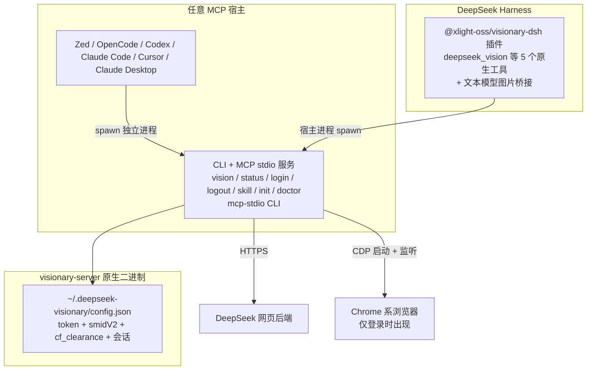

# DeepSeek Visionary

**让 DeepSeek 网页版视觉模型，成为你所有 AI 助手的"眼睛"。** 在 Zed、OpenCode、Codex、Claude Code、Cursor、Claude Desktop 等任意支持 MCP 的 agent，以及 DeepSeek Harness（DSH，原生插件或 skill + CLI）中直接识图——浏览器自动登录，**无需 API key、无需手动复制 token**。

Python 版 `deepseek-vision-mcp` 的 **Rust 全量重写**：单原生二进制、多平台分发，一处安装处处可用。DSH 用户更可 `dsh plugin` 一键安装原生插件包 `@xlight-oss/visionary-dsh`——4 个原生视觉工具 + 文本模型图片桥接，**一包全齐**。

## 架构



- **visionary-server**：单二进制，默认 CLI 模式（`vision` / `status` / `login` / `logout` / `skill` / `init` / `doctor`），`mcp-stdio` 子命令显式启动 MCP stdio 服务；实现完整 vision 流水线（PoW → 上传 → fork → HIF 签名 → SSE 流式 completion）与 CDP 自动登录
- **@xlight-oss/visionary-dsh**：DSH 原生插件包（npm，纯 ESM 无构建，单包双插件行），经 `ctx.tools` 注册 `deepseek_vision` / `deepseek_ocr` 等 5 个原生工具，宿主进程内 spawn `visionary-server` 复用 Rust 管道（续聊/登录不受 bash 沙箱限制）；内置文本模型图片桥接（纯文本模型会话粘贴图片自动放行 + 改写为文本引导）
- **visionary-zed-ext**：Zed 扩展壳（仅 Zed 需要），按平台从 GitHub Releases 下载/缓存 visionary-server 并启动

## 安装

### 1. 安装二进制

```bash
# macOS / Linux 一键脚本
curl -LsSf https://github.com/xlight/deepseek-visionary/releases/latest/download/visionary-server-installer.sh | sh

# Windows（PowerShell 一键，自动绕过执行策略）
powershell -NoProfile -ExecutionPolicy Bypass -Command "irm https://github.com/xlight/deepseek-visionary/releases/latest/download/visionary-server-installer.ps1 | iex"

# 或 Homebrew
brew install xlight/tap/visionary-server

# 或 npm（全平台）
npm install -g @xlight-oss/visionary-server
```

> 也可以直接从 GitHub Releases 下载对应平台的 `visionary-server-<target-triple>` 裸二进制加入 PATH（Windows 为 `.exe`，或 `.zip` 解压）。
> Windows 安装脚本默认装到 `$HOME\.cargo\bin` 并自动写入 PATH（加 `-NoModifyPath` 可跳过）；该目录只是 cargo-dist 的默认命名约定，**不要求安装 cargo**——非 Rust 用户可用 `VISIONARY_SERVER_INSTALL_DIR` 环境变量自定义安装目录，或直接用 npm 全局包。首次运行若遇 SmartScreen 弹窗，点「更多信息 → 仍要运行」即可。
> **npm 全局包注意**：Windows 上 `npm install -g @xlight-oss/visionary-server` 的 PATH 里只有 shim（`.cmd` / `.ps1`），DSH 原生插件会自动解析 shim 定位真实 exe——安装后重启 DSH 即可用。

### 2. 快速开始（CLI + skill，推荐）

CLI 是零配置入口：安装后即可直接在终端 / 脚本 / AI agent 中调用 `vision` 识图，无需任何 MCP 配置。首次使用先登录：

```bash
# 浏览器自动登录（后续无需重复）
visionary-server login

# 识图（agent/脚本调用务必加 --json 原子输出）
visionary-server vision screenshot.png
visionary-server vision img.png --json --prompt "图中有什么？" --thinking
```

给 AI agent 使用时，把内嵌的调用契约 skill 装进 agent 的 skills 目录，agent 即学会以 `--json` 原子输出正确调用：

```bash
# skill 内嵌于二进制，一条命令安装/更新
visionary-server skill install
# → 写入 ~/.agents/skills/visionary-cli/SKILL.md
# 可将该目录移动到所用 agent 的默认 skills 目录
```

### 3. 进阶：接入 MCP 宿主

需要把 `deepseek_vision` 作为 MCP 工具暴露给宿主（Zed / OpenCode / Codex / Claude Code / Cursor / Claude Desktop）时，用 `init` 一键接入：

```bash
# 一键检测并接入（列出已安装 agent）
visionary-server init

# 接入指定 agent
visionary-server init opencode
visionary-server init codex
visionary-server init claude
visionary-server init cursor
visionary-server init claude-desktop
visionary-server init dsh   # DeepSeek Harness（skill + CLI 轻量接入）

# 批量接入多个 agent（免交互）
visionary-server init --opencode --codex --dsh --yes

# 先预览将写入的配置（不落盘）
visionary-server init opencode --dry-run
```

各 agent 的详细接入文档见 [docs/integrations/](docs/integrations/)：

| Agent | 文档 | 一键命令 |
|-------|------|----------|
| Zed | [zed.md](docs/integrations/zed.md) | 扩展市场安装（见下） |
| OpenCode | [opencode.md](docs/integrations/opencode.md) | `visionary-server init opencode` |
| Codex | [codex.md](docs/integrations/codex.md) | `visionary-server init codex` |
| Claude Code | [claude-code.md](docs/integrations/claude-code.md) | `visionary-server init claude` |
| Cursor | [cursor.md](docs/integrations/cursor.md) | `visionary-server init cursor` |
| Claude Desktop | [claude-desktop.md](docs/integrations/claude-desktop.md) | `visionary-server init claude-desktop` |
| DeepSeek Harness | [deepseek-harness.md](docs/integrations/deepseek-harness.md) | 原生插件 `dsh plugin --profile web add @xlight-oss/visionary-dsh`（推荐）或 `visionary-server init dsh`（skill + CLI 轻量接入） |

> **DeepSeek Harness 原生插件**：DSH 用户还可安装 npm 插件包 `@xlight-oss/visionary-dsh`，把 `deepseek_vision` / `deepseek_ocr` / `deepseek_vision_status` / `deepseek_vision_login` / `deepseek_vision_logout` 注册为 DSH 原生工具（结构化 schema、宿主级执行，续聊/登录不受 bash 沙箱限制），安装详见 [packages/dsh-plugin/README.md](packages/dsh-plugin/README.md)。

> 新兴通道：Microsoft Agent Package Manager 用户可直接
> `apm install --mcp io.github.xlight/deepseek-visionary`（复用 MCP Registry 标识）。

### 4. DeepSeek Harness 原生插件（DSH 用户推荐）

DSH 用户除 `init dsh`（skill + CLI）外，更推荐安装原生插件，获得宿主级权限与结构化工具 schema：

```bash
# 前置：安装二进制（见上文）并确保能被插件找到
#       （Config.binaryPath → DEEPSEEK_VISIONARY_BIN → PATH 任一即可）

# 一键安装（npm 包，发布后）
dsh plugin --profile web add @xlight-oss/visionary-dsh

# 或本地路径（开发验证）
dsh plugin --profile web add /path/to/packages/dsh-plugin
```

`dsh plugin` 经包内 `dsh.bundle.patch` 声明自动注册 `visionary-vision` 与 `visionary-image-bridge` 两个插件行，重启 DSH 后 5 个原生工具出现在工具目录，桥接同时生效（模型可直接调用，无需手写任何配置）。验证：`dsh --profile web --dump-config` 应出现单个 `@xlight-oss/visionary-dsh` 层。详见 [packages/dsh-plugin/README.md](packages/dsh-plugin/README.md)。

> **文本模型下粘贴图片被拒绝？** 本插件已内置图片桥接（`visionary-image-bridge` 插件行，无需额外安装）：
> 纯文本模型会话中粘贴的图片经桥接**放行 → 落盘 → 改写为文本引导**，
> agent 用 `deepseek_vision` 完成分析，模型只收到文本；VL 模型原生看图不受干扰。
> 配置/隐私说明见 [packages/dsh-plugin/README.md](packages/dsh-plugin/README.md) 的「工具」与「图片桥接」节（设置面板 → 左侧导航 → **Visionary**，`visionary-vision:` / `visionary-image-bridge:` settings 命名空间，热重载）。

### 5. 登录

登录凭据保存在 `~/.deepseek-visionary/config.json`，CLI / MCP / DSH 插件三路共享；浏览器自动登录会打开窗口导航到 chat.deepseek.com，登录后自动抓取 token 并保存：

- CLI：`visionary-server login`（可先 `status --json` 预检）
- MCP / DSH 原生工具：调用 `deepseek_vision_login`

> 手动兜底：登录 chat.deepseek.com 后，DevTools → Application → Local Storage →
> `userToken` → 复制 `JSON.parse(value).value`，写入 `~/.deepseek-visionary/config.json`：
>
> ```json
> { "user_token": "你的 token" }
> ```

### 6. 使用

- **CLI**：`visionary-server vision <image>` 识图（详见下文「CLI 工具」）
- **MCP / DSH 原生工具**：调用 `deepseek_vision` 传入图片路径 / base64 / data URI 即可识图

## Zed 扩展安装

> 如果你只用 Zed，也可以直接从扩展市场安装：

1. Zed 命令面板（`Cmd+Shift+P`）→ `zed: extensions` → 搜索 **DeepSeek Visionary** → Install
2. 扩展壳自动下载/缓存 `visionary-server` 二进制并启动 MCP 服务
3. 授权工具权限（见 [docs/integrations/zed.md](docs/integrations/zed.md)）

## CLI 工具

| 命令 | 说明 |
|------|------|
| `visionary-server`（无参数） | 输出 help 用法信息并退出码 2（不进入任何模式） |
| `visionary-server --version` | 输出版本号 |
| `visionary-server mcp-stdio` | 显式启动 MCP stdio 服务（MCP 模式入口，所有 agent 配置均以此启动） |
| `visionary-server vision <image>...` | 用视觉模型分析一张或多张图片（CLI 版 `deepseek_vision`）。`image` 支持路径 / base64 / data URI / `-`（stdin，仅单图）；多图一次上传联合分析（与网页端多图行为一致）；`--prompt` / `--thinking` / `--continue-conversation` / `--session-id` / `--json` / `--stream` / `--no-stream` / `--model-type`（`vision` 或 `ocr`，默认 vision） |
| `visionary-server ocr <image>...` | 用纯 OCR 管道原样提取图片中的文字（CLI 版 `deepseek_ocr`，等价 `vision --model-type ocr`）。参数面对齐 `vision`（无 `--model-type`，恒为 ocr）；默认提示词为文字提取语义；无文字图片输出业务提示并退出非零 |
| `visionary-server status` | 轻量鉴权状态检查（CLI 版 `deepseek_vision_status`），`--json` 输出结构化状态 |
| `visionary-server login` | 浏览器自动登录（CLI 版 `deepseek_vision_login`） |
| `visionary-server logout` | 清除保存的凭据（CLI 版 `deepseek_vision_logout`） |
| `visionary-server skill install` | 安装 agent 调用契约 skill 到 `~/.agents/skills/`（内嵌于二进制） |
| `visionary-server doctor` | 诊断环境：config 路径/权限、浏览器、token 有效性、平台 |
| `visionary-server init [agent]` | 检测并接入已安装的 AI agent（`--dry-run` / `--yes` / 多选 flags，含 `dsh`） |

### CLI 输出模式（`vision`）

`vision` 的输出模式由 stdout 是否 TTY 与显式开关共同决定：

| 场景 | 默认行为 | 消费方 |
|------|----------|--------|
| 终端（TTY） | 流式打印回答文本 | 人 |
| 管道/脚本（非 TTY） | 一次性输出完整文本 | 脚本兑底 |
| `visionary-server vision img.png --json` | 原子 JSON：`{"text", "session_id", "parent_message_id"}`（失败为 `{"error"}`） | 脚本 / AI agent（推荐） |

`--stream` / `--no-stream` 可强制指定模式；`--json` 恒为原子输出（不与 `--stream` 同用）。失败时退出码非零。

```bash
# 终端交互：流式输出
visionary-server vision screenshot.png

# 脚本/agent：结构化输出
visionary-server vision img.png --json --prompt "图中有什么？"

# 管道输入
cat img.png | visionary-server vision - --json
```

### AI agent 使用（CLI + Skill）

CLI 也是 AI agent 的零 MCP 配置工具面：只要 `visionary-server` 在 PATH，任何能执行 shell 的 agent 都可以调用它。二进制内嵌 agent 调用契约 `SKILL.md`（随安装具备），核心约定：**agent 调用 `vision` 必须加 `--json` 原子输出**（流式文本无结构化边界，不可可靠解析）。

安装 skill 到 agent skill 目录（以 Zed 为例）：

```bash
# skill 内嵌于二进制，无需本地仓库，一条命令安装/更新
visionary-server skill install
# → 写入 ~/.agents/skills/visionary-cli/SKILL.md
```

> **DeepSeek Harness（DSH）**：DSH 默认扫描 `~/.agents/skills` 与 `~/.dsh/skills` 作为技能根，上述位置天然兼容；运行 `visionary-server init dsh` 会额外写入 DSH 专属技能根并汇总提示（见 [deepseek-harness.md](docs/integrations/deepseek-harness.md)）。DSH 用户更推荐安装原生插件 `@xlight-oss/visionary-dsh`（`dsh plugin --profile web add`），把 `deepseek_vision` 等注册为宿主级原生工具，续聊/登录不受 bash 沙箱限制（见 [packages/dsh-plugin/README.md](packages/dsh-plugin/README.md)）。

## 工具面（MCP / DSH 原生）

同一组工具既以 MCP 工具暴露给 MCP 宿主，也以 DSH 原生工具注册给 DeepSeek Harness（命名与 schema 一致）：

| 工具 | 说明 |
|------|------|
| `deepseek_vision` | 上传一张或多张图片（路径 / base64 / data URI）并用 DeepSeek 视觉模型分析；多图经 `images` 数组一次上传、模型联合分析（与网页端多图行为一致）。参数：`images`（多图）/ `image`（单图，向后兼容，二选一）、`prompt`、`thinking`、`continue_conversation`、`session_id` |
| `deepseek_ocr` | 用纯 OCR 管道原样提取图片中的文字（等价 CLI `visionary-server ocr`）。定位于**文字提取**而非理解：截图 / 文档 / 代码 / 表格 / 标识。参数面与 `deepseek_vision` 完全一致；图片无文字时以错误提示返回「图片中未提取到文字」 |
| `deepseek_vision_status` | 检查登录状态与 token 有效性（含真实校验探针） |
| `deepseek_vision_login` | 浏览器自动登录并抓取凭据（阻塞，超时可配） |
| `deepseek_vision_logout` | 清除保存的凭据 |

> **质量提示**：OCR 结果来自服务端文本提取管道，对清晰截图/文档效果好；放大模糊、手写或复杂版式时结果可能不完整。需要结合上下文理解内容（翻译、总结版式）时用 `deepseek_vision`，`deepseek_ocr` 只负责拿原文。

### 会话续聊

`deepseek_vision`（及 `deepseek_ocr`）支持多轮对话：

- `continue_conversation=true`：复用上一次会话，可对比多张图片
- `session_id`：显式切换到指定会话线程

会话状态持久化在 `~/.deepseek-visionary/session.json`。

## 环境变量

| 变量 | 说明 |
|------|------|
| `DEEPSEEK_USER_TOKEN` | 覆盖 config.json 中的 token（可选） |
| `DEEPSEEK_SMIDV2` / `DEEPSEEK_CF_CLEARANCE` | 覆盖对应 cookie（可选） |
| `DEEPSEEK_BASE_URL` | API 基地址（默认 `https://chat.deepseek.com`） |
| `DEEPSEEK_LOGIN_TIMEOUT` | 登录等待超时秒数（默认 600） |
| `DEEPSEEK_VISIONARY_MODEL_TYPE` | 默认上传管道模型类型（`vision` 或 `ocr`，默认 `vision`；CLI `--model-type` 优先于该变量） |
| `DEEPSEEK_VISIONARY_BIN` | DSH 插件解析二进制路径（`Config.binaryPath` → 此变量 → PATH） |

## 开发

```bash
# 构建原生服务
cargo build -p visionary-server --release

# 构建扩展壳（wasm32-wasip2）
rustup target add wasm32-wasip2
cargo build -p visionary-zed-ext --release --target wasm32-wasip2

# 测试
cargo test -p visionary-server

# DSH 插件包（纯 ESM，无构建；开发需装 devDependencies 供本地 link 安装解析 peer）
cd packages/dsh-plugin && pnpm install
```

## 发布

版本号由 `scripts/bump_version.py` 统一管理（同步 Cargo.toml / Cargo.lock×2 / extension.toml / packages/dsh-plugin/package.json / packages/dsh-plugin/lib/index.mjs 的 `COMPAT_MINOR` / server.json 共 7 个版本条目并校验一致性）：

```bash
# 只 bump + 校验 + 打印步骤
python3 scripts/bump_version.py <new-version>

# 一键发布：bump + commit + tag vX.Y.Z + push
# （tag push 触发 cargo-dist 二进制发布 / Zed 扩展同步 / npm 发布三个 workflow）
python3 scripts/bump_version.py <new-version> --release
```

发布完成后，`update-server-json` workflow（`workflow_run` 监听 Release 成功）自动下载 5 平台 `.mcpb`、运行
`scripts/update_server_json.py` 并把 `server.json` 的 `fileSha256` 回填为实际产物哈希（MCP Registry 元数据，commit 回 main）。
若该 workflow 未触发（如手动建 release），可手动兜底：

```bash
gh release download v<version> --pattern "*.mcpb" --dir dist --clobber
python3 scripts/update_server_json.py <version> v<version> dist/
```

## 平台支持

- macOS（Apple Silicon / Intel）
- Linux（x86_64 / aarch64）
- Windows（x86_64）

需要 Chrome / Chromium / Edge 之一用于自动登录。

## 工作原理（要点）

- **PoW**：wasmtime 加载 DeepSeek 站内 `sha3_wasm_bg.*.wasm`（随仓库分发），调用 `wasm_solve` 求解 `upload_file` 与 `completion` 的 challenge
- **TLS 指纹**：completion 端点与 Python 版（curl_cffi chrome131）对齐；Rust 侧默认普通 reqwest，若被 403 再启用指纹模拟（见 design.md spike 记录）
- **登录**：CDP 控制 Chrome 系浏览器（专用 profile `~/.deepseek-visionary/browser/`），读取 `localStorage.userToken` 与 `smidV2` / `cf_clearance` cookie
- **凭据安全**：`~/.deepseek-visionary/config.json` 权限 0600，浏览器 profile 0700

## License

MIT
