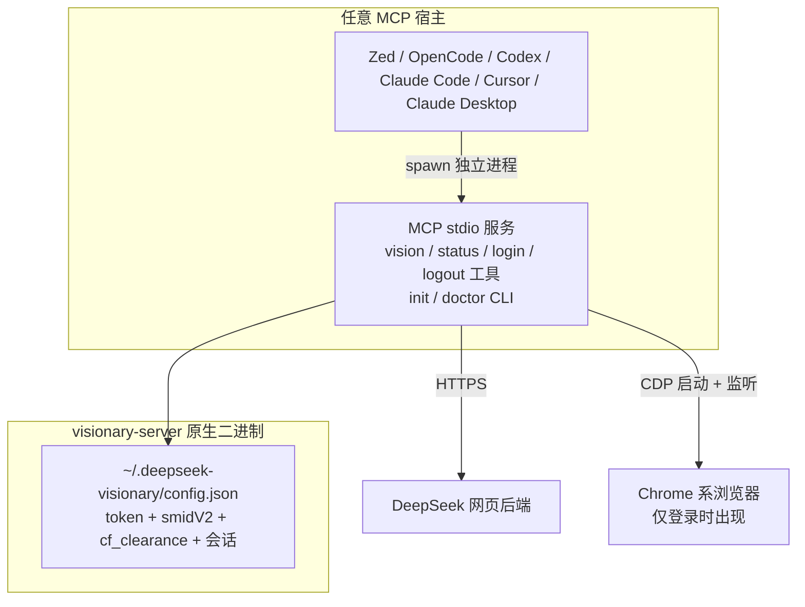

# DeepSeek Visionary

在任意支持 MCP 的 AI agent（Zed、OpenCode、Codex、Claude Code、Cursor、Claude Desktop）中使用 **DeepSeek 网页版的原生多模态视觉模型**，支持**浏览器自动登录**（无需手动复制 token）。

这是 Python 版 `deepseek-vision-mcp` 的 Rust 全量重写：单原生二进制，多平台分发。

## 架构



- **visionary-server**：标准 MCP stdio 服务，实现完整 vision 流水线（PoW → 上传 → fork → HIF 签名 → SSE 流式 completion）与 CDP 自动登录；同时提供 `init` / `doctor` CLI 引导接入
- **visionary-zed-ext**：Zed 扩展壳（仅 Zed 需要），按平台从 GitHub Releases 下载/缓存 visionary-server 并启动

## 安装

### 1. 安装二进制

```bash
# 一键脚本（macOS / Linux）
curl -LsSf https://github.com/xlight/deepseek-visionary/releases/latest/download/visionary-server-installer.sh | sh

# 或 Homebrew
brew install xlight/tap/visionary-server

# 或 npm
npm install -g @xlight-oss/visionary-server
```

> 也可以直接从 GitHub Releases 下载对应平台的 `visionary-server-<target-triple>` 裸二进制加入 PATH。
> Windows 用户可使用 PowerShell 安装脚本。

### 2. 接入你的 AI agent

```bash
# 一键检测并接入（列出已安装 agent）
visionary-server init

# 接入指定 agent
visionary-server init opencode
visionary-server init codex
visionary-server init claude
visionary-server init cursor
visionary-server init claude-desktop

# 批量接入多个 agent（免交互）
visionary-server init --opencode --codex --yes

# 先预览将写入的配置（不落盘）
visionary-server init opencode --dry-run
```

各 agent 的详细接入文档见 [docs/integrations/](docs/integrations/)：

| Agent | 文档 | 一键命令 |
|-------|------|----------|
| Zed | [zed.md](docs/integrations/zed.md) | 扩展市场安装（见下） |
| OpenCode | [opencode.md](docs/integrations/opencode.md) | `visionary-server init opencode` |
| Codex | [codex.md](docs/integrations/codex.md) | `visionary-server init codex` |
| Claude Code | [claude-code.md](docs/integrations/claude-code.md) | `visionary-server init claude` |
| Cursor | [cursor.md](docs/integrations/cursor.md) | `visionary-server init cursor` |
| Claude Desktop | [claude-desktop.md](docs/integrations/claude-desktop.md) | `visionary-server init claude-desktop` |

> 新兴通道：Microsoft Agent Package Manager 用户可直接
> `apm install --mcp io.github.xlight/deepseek-visionary`（复用 MCP Registry 标识）。

### 3. 登录

调用 MCP 工具的 `deepseek_vision_login` 完成自动登录：

- 会打开浏览器窗口并导航到 chat.deepseek.com
- 在浏览器中登录后，工具自动抓取 token 并保存

> 手动兜底：登录 chat.deepseek.com 后，DevTools → Application → Local Storage →
> `userToken` → 复制 `JSON.parse(value).value`，写入 `~/.deepseek-visionary/config.json`：
>
> ```json
> { "user_token": "你的 token" }
> ```

### 4. 使用

调用 `deepseek_vision` 传入图片路径或 base64 即可识图。

## Zed 扩展安装

> 如果你只用 Zed，也可以直接从扩展市场安装：

1. Zed 命令面板（`Cmd+Shift+P`）→ `zed: extensions` → 搜索 **DeepSeek Visionary** → Install
2. 扩展壳自动下载/缓存 `visionary-server` 二进制并启动 MCP 服务
3. 授权工具权限（见 [docs/integrations/zed.md](docs/integrations/zed.md)）

## CLI 工具

| 命令 | 说明 |
|------|------|
| `visionary-server`（无参数） | 进入 MCP stdio serve 模式（所有 agent 配置的默认入口） |
| `visionary-server --version` | 输出版本号 |
| `visionary-server vision <image>` | 用视觉模型分析图片（CLI 版 `deepseek_vision`）。`image` 支持路径 / base64 / data URI / `-`（stdin）；`--prompt` / `--thinking` / `--continue` / `--session-id` / `--json` / `--stream` / `--no-stream` |
| `visionary-server status` | 轻量鉴权状态检查（CLI 版 `deepseek_vision_status`），`--json` 输出结构化状态 |
| `visionary-server login` | 浏览器自动登录（CLI 版 `deepseek_vision_login`） |
| `visionary-server logout` | 清除保存的凭据（CLI 版 `deepseek_vision_logout`） |
| `visionary-server skill install` | 安装 agent 调用契约 skill 到 `~/.agents/skills/`（内嵌于二进制） |
| `visionary-server doctor` | 诊断环境：config 路径/权限、浏览器、token 有效性、平台 |
| `visionary-server init [agent]` | 检测并接入已安装的 AI agent（`--dry-run` / `--yes` / 多选 flags） |

### CLI 输出模式（`vision`）

`vision` 的输出模式由 stdout 是否 TTY 与显式开关共同决定：

| 场景 | 默认行为 | 消费方 |
|------|----------|--------|
| 终端（TTY） | 流式打印回答文本 | 人 |
| 管道/脚本（非 TTY） | 一次性输出完整文本 | 脚本兑底 |
| `visionary-server vision img.png --json` | 原子 JSON：`{"text", "session_id", "parent_message_id"}`（失败为 `{"error"}`） | 脚本 / AI agent（推荐） |

`--stream` / `--no-stream` 可强制指定模式；`--json` 恒为原子输出（不与 `--stream` 同用）。失败时退出码非零。

```bash
# 终端交互：流式输出
visionary-server vision screenshot.png

# 脚本/agent：结构化输出
visionary-server vision img.png --json --prompt "图中有什么？"

# 管道输入
cat img.png | visionary-server vision - --json
```

### AI agent 使用（CLI + Skill）

CLI 也是 AI agent 的零 MCP 配置工具面：只要 `visionary-server` 在 PATH，任何能执行 shell 的 agent 都可以调用它。二进制内嵌 agent 调用契约 `SKILL.md`（随安装具备），核心约定：**agent 调用 `vision` 必须加 `--json` 原子输出**（流式文本无结构化边界，不可可靠解析）。

安装 skill 到 agent skill 目录（以 Zed 为例）：

```bash
# skill 内嵌于二进制，无需本地仓库，一条命令安装/更新
visionary-server skill install
# → 写入 ~/.agents/skills/visionary-cli/SKILL.md
```

## MCP 工具

| 工具 | 说明 |
|------|------|
| `deepseek_vision` | 上传本地图片（路径 / base64）并用 DeepSeek 视觉模型分析。参数：`image`（必填）、`prompt`、`thinking`、`continue_conversation`、`session_id` |
| `deepseek_vision_status` | 检查登录状态与 token 有效性（含真实校验探针） |
| `deepseek_vision_login` | 浏览器自动登录并抓取凭据 |
| `deepseek_vision_logout` | 清除保存的凭据 |

### 会话续聊

`deepseek_vision` 支持多轮对话：

- `continue_conversation=true`：复用上一次会话，可对比多张图片
- `session_id`：显式切换到指定会话线程

会话状态持久化在 `~/.deepseek-visionary/session.json`。

## 环境变量

| 变量 | 说明 |
|------|------|
| `DEEPSEEK_USER_TOKEN` | 覆盖 config.json 中的 token（可选） |
| `DEEPSEEK_SMIDV2` / `DEEPSEEK_CF_CLEARANCE` | 覆盖对应 cookie（可选） |
| `DEEPSEEK_BASE_URL` | API 基地址（默认 `https://chat.deepseek.com`） |
| `DEEPSEEK_LOGIN_TIMEOUT` | 登录等待超时秒数（默认 600） |

## 开发

```bash
# 构建原生服务
cargo build -p visionary-server --release

# 构建扩展壳（wasm32-wasip2）
rustup target add wasm32-wasip2
cargo build -p visionary-zed-ext --release --target wasm32-wasip2

# 测试
cargo test -p visionary-server
```

## 平台支持

- macOS（Apple Silicon / Intel）
- Linux（x86_64 / aarch64）
- Windows（x86_64）

需要 Chrome / Chromium / Edge 之一用于自动登录。

## 工作原理（要点）

- **PoW**：wasmtime 加载 DeepSeek 站内 `sha3_wasm_bg.*.wasm`（随仓库分发），调用 `wasm_solve` 求解 `upload_file` 与 `completion` 的 challenge
- **TLS 指纹**：completion 端点与 Python 版（curl_cffi chrome131）对齐；Rust 侧默认普通 reqwest，若被 403 再启用指纹模拟（见 design.md spike 记录）
- **登录**：CDP 控制 Chrome 系浏览器（专用 profile `~/.deepseek-visionary/browser/`），读取 `localStorage.userToken` 与 `smidV2` / `cf_clearance` cookie
- **凭据安全**：`~/.deepseek-visionary/config.json` 权限 0600，浏览器 profile 0700

## License

MIT
