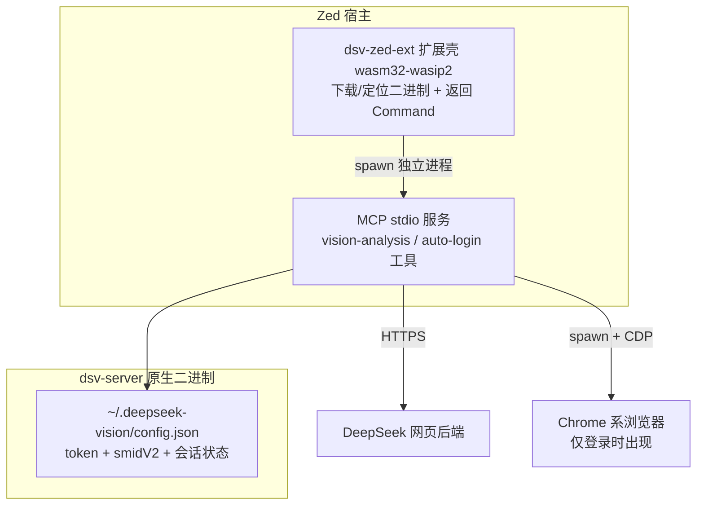

## Context

现有 Python 版 `deepseek-vision-mcp` 已跑通 DeepSeek 网页版识图全流程，其中两块硬骨头是：

- **TLS 指纹**：completion 端点需模拟 Chrome131 指纹（curl_cffi），其他端点（上传/fork/会话/PoW）普通 httpx 即可。
- **PoW 求解**：需要执行 DeepSeek 站内的 `sha3_wasm_bg.*.wasm`（wasmtime 加载）。

同时存在两个 UX 硬伤：依赖 Python 3.11+ 与多个重型依赖；token 需用户手动从浏览器 DevTools 复制。

Zed 侧的机制约束：Zed 扩展被编译为 `wasm32-wasip2` 运行在 WASM 沙箱内，不能做 TLS 指纹模拟、跑 wasmtime 或重网络操作；扩展通过 `context_server_command` 返回要启动的**独立进程**命令。且 Zed 官方计划弃用 MCP 扩展通道，转向官方 MCP registry。

## Goals / Non-Goals

**Goals:**
- 单一 Rust 原生二进制完整实现 vision 流水线与 MCP stdio 服务，功能等价于 Python 版（含会话续聊）。
- 浏览器自动登录获取 token（CDP），零手动复制。
- Zed 扩展壳按平台下载/定位二进制并启动。
- 多平台分发：macOS / Linux / Windows。

**Non-Goals:**
- 不逆向 DeepSeek 密码登录 API（验证码与风控脆弱，且涉及凭据安全）。
- 不做远程 MCP 服务器形态（本地 stdio 即可满足 Zed 场景）。
- 不维护/迁移 Python 仓库，独立新仓库开发。

## Decisions

1. **双 crate workspace：`dsv-server`（原生二进制）+ `dsv-zed-ext`（wasm32-wasip2 扩展壳）**
   - 理由：扩展沙箱做不了重活，`context_server_command` 的职责就是返回要启动的进程。二进制与扩展解耦后，同一份资产可同时走"Zed 扩展市场"与"MCP registry"两条分发通道，对冲 Zed 弃用扩展通道的风险。
   - 备选：扩展内嵌全部逻辑（沙箱不可行）；仅 settings 配置二进制（无扩展市场发现性，作为兜底保留）。
   - 实现 `context_server_configuration`（真实 MCP 扩展的标准模式，三个字段均为必填 String）：`installation_instructions` 提供登录引导；`default_settings` 与 `settings_schema` 仅声明可选的 `server_path`（开发/调试用），不含必填配置，仍保持"装完即用"。用户设置经 `zed_extension_api::settings::ContextServerSettings::for_project` 读取。
   - 环境变量透传：`context_server_command` 中从**扩展进程环境**读取 `DEEPSEEK_USER_TOKEN`（若存在）并透传；该值仅为覆盖，凭据在 `config.json` 时由服务自行读取，扩展无需感知 token。`Command` 的 `env` 字段为 `Vec<(String, String)>`，用 `Command::new().args().envs()` 链式构建。
   - **修订说明**：实测 zed_extension_api 0.7 的 `context_server_command` 只能拿到 `Project`（仅 `worktree_ids()`，无构造 `Worktree` 的 API），无法读取 `worktree.shell_env()`，因此原“Worktree env 透传”降级为“扩展进程环境透传”。用户如在启动 Zed 的 shell 中设置 `DEEPSEEK_USER_TOKEN`，子进程会自然继承；主凭据路径仍为 login 自动写入的 `config.json`。

2. **TLS 指纹：spike 前置，`impersonate` crate 为主备选**
   - 先以普通 `reqwest`（rustls/native-tls）跑通 completion；若被 403 拒绝，改用 `impersonate`（curl_cffi 作者维护的 Rust 实现，BoringSSL 指纹模拟）。
   - 备选：`tls-client` crate；捆绑 `curl-impersonate` 二进制（违背单二进制初衷，弃）。

3. **PoW 求解：复用 `wasmtime` crate 与现有 `.wasm` 资产**
   - 直接调用导出函数 `wasm_solve`，Python 版 `pow.py` 作为逐行移植参考。
   - 备选：纯 Rust 重写哈希算法（工作量大、正确性风险高，弃）。
   - **Spike 结论（任务 1.3，已验证）**：wasmtime 37 成功加载 `sha3_wasm_bg.7b9ca65ddd.wasm`，`__wbindgen_add_to_stack_pointer` / `__wbindgen_export_0`（malloc）/ `wasm_solve` 三个导出函数调用链与返回值解析（retptr 处 i32 status + f64 answer）全部复现 Python 版逻辑。合成 challenge 下 wasm 内部哈希校验返回 status==0（answer=null），证明调用机制正确；真实 challenge 的答案 fixture 需 token 后从线上抓取固化（任务 8.4）。

4. **MCP 框架：`rmcp` 优先，官方 `mcp` SDK 备选**
   - spike 时验证 stdio transport 与工具列表/调用能力，二选一。
   - **Spike 结论（任务 1.4，已选定）**：采用官方 `rmcp`（modelcontextprotocol/rust-sdk 的核心 crate）v2.2，features `["server", "transport-io", "schemars"]`。stdio transport 成熟，支持 MCP 2025-06-18 协议；工具用 `#[tool_router]` / `#[tool_handler]` / `#[tool]` 宏声明，参数经 `Parameters<T>` + `schemars::JsonSchema` 自动生成 schema。未来可无痛扩展 streamable HTTP。备选（官方 rust-sdk 早期 stdio-only 形态 / 社区 mcp-protocol-sdk）弃用。

5. **自动登录：CDP 浏览器方案（`chromiumoxide`）**
   - 专用登录 profile（`~/.deepseek-vision/browser/`，目录权限 0700）+ `--remote-debugging-port`。Chrome 136+ 强制要求非默认 profile 才允许远程调试，正好天然满足。
   - 读取 `localStorage.userToken`（`JSON.parse(value).value`）与 `smidV2`、`cf_clearance` cookie；后台监听完成登录后关闭浏览器，profile 持久化供下次复用。
   - 通过 MCP 工具 `deepseek_vision_login` / `deepseek_vision_logout` 暴露；`deepseek_vision_status` 做真实 token 校验（调轻量鉴权接口），失效时提示重新登录。
   - 手动粘贴 token 保留为兜底路径。
   - 备选：HTTP 模拟登录（安全与风控风险，弃）。

6. **凭据与配置：`~/.deepseek-vision/config.json`（chmod 600）+ 环境变量覆盖**
   - 键名对齐 Python：`user_token` / `smid_v2` / `cf_clearance`；环境变量 `DEEPSEEK_USER_TOKEN` / `DEEPSEEK_SMIDV2` / `DEEPSEEK_CF_CLEARANCE` 可覆盖。
   - 超时与重试对齐 Python：`poll_timeout=60`、`chat_timeout=120`、`upload_timeout=60`、`max_retries=3`；fork 等待 30s；上传轮询含失败终态列表（CONTENT_FILTER 等）。
   - 图片压缩对齐 Python：max_dim=2048、超过 20MB 才压缩、RGBA→RGB、PNG optimize。
   - 服务启动时加载，login 后热重载；会话续聊状态沿用同目录 `session.json`，对齐 Python 行为。
   - 配置以 RwLock 保护，热重载时原子替换，避免与并发工具调用竞态。

7. **分发：GitHub Actions release 矩阵**
   - 目标平台：macOS arm64/x86_64、Linux x86_64/aarch64、Windows x86_64。
   - 扩展壳用 `latest_github_release` / `download_file` / `make_file_executable` 按平台拉取对应 asset；按版本目录缓存，版本对比决定是否更新，首次下载发生在 `context_server_command` 调用时。

## Risks / Trade-offs

- **TLS 指纹（最大未知数）** → spike 先行；若 `impersonate` 平台覆盖不全（尤其 macOS），退而评估 `tls-client`，或验证指纹是否真为硬性要求。
- **DeepSeek 接口变更** → 与 Python 版同风险；各端点封装为独立模块便于快速适配。
- **`.wasm` 资产来源**（DeepSeek 站内逆向产物） → 沿用 Python 仓库既有资产，随仓库分发，与现状一致。
- **CDP 依赖树较重**（chromiumoxide + websocket） → 仅 login 路径使用，不影响流水线；无 Chrome 系浏览器时回退手动粘贴。
- **hif-dliq 仅 AAAA 记录** → macOS 走系统 happy-eyeballs 一般可用；保留自定义解析兜底（解析 leim 的 IPv4 + 携带 dliq SNI，同 CloudFront 分发）。

## Migration Plan

- 新仓库独立开发，与 Python 版并行；以"同一图片 + 同一 prompt 输出一致"作为功能等价验收。
- Zed 用户安装扩展即完成切换；Python 版冻结不再演进。

## Open Questions

- completion 端点 TLS 指纹是否为硬性要求（spike 结论决定 `impersonate` 方案取舍）。
- ~~`rmcp` 与官方 `mcp` SDK 的 stdio 成熟度对比~~（已定：`rmcp` v2.2，见 Decisions 4）。
- token 有效期与失效自动提示策略（登录工具幂等重跑即可覆盖，无需过度设计）。
- status 工具真实校验 token 的轻量鉴权端点（Python 版只查非空、从不调 API，这是净新增行为，需 spike 验证可用端点）。
